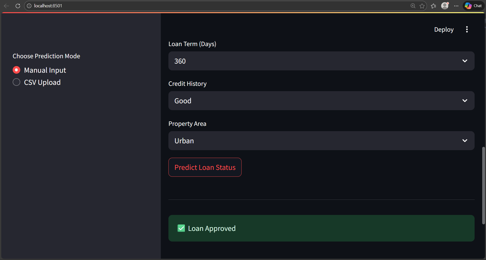
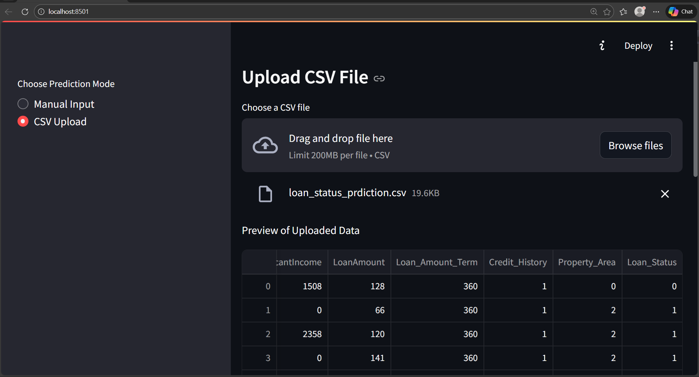

# 🏦 Loan Status Prediction Using Random Forest Algorithm

## 📌 Project Overview

Loan approval is a critical task for financial institutions, directly impacting risk management and profitability.
This project implements a **supervised machine learning classification system** to predict whether a loan application will be **Approved** or **Rejected**, based on applicant demographic, financial, and credit-related features.

The **Random Forest Classifier** is used due to its robustness, ability to handle non-linear feature interactions, and resistance to overfitting.
A user-friendly **Streamlit web application** is developed to provide real-time predictions.

## 🎯 Objectives

* Build an accurate and reliable **loan status prediction model**
* Apply proper **data preprocessing and feature engineering**
* Evaluate the model using standard **classification metrics**
* Deploy the trained model using a **web-based interface**
* Enable both **manual input** and **CSV-based batch prediction**

## 📊 Dataset Description

The dataset contains historical loan application records with both numerical and categorical features:

| Feature           | Description             |
| ----------------- | ----------------------- |
| Gender            | Applicant gender        |
| Married           | Marital status          |
| Dependents        | Number of dependents    |
| Education         | Education level         |
| Self_Employed     | Employment status       |
| ApplicantIncome   | Applicant income        |
| CoapplicantIncome | Co-applicant income     |
| LoanAmount        | Requested loan amount   |
| Loan_Amount_Term  | Loan repayment duration |
| Credit_History    | Credit history record   |
| Property_Area     | Property location type  |

🎯 **Target Variable:**
**Loan_Status** → Approved (Y) / Rejected (N)

## ⚙️ Methodology

### 1️⃣ Data Preprocessing

* Handling missing values
* Encoding categorical variables
* Feature scaling (where required)
* Train-test split for evaluation

### 2️⃣ Model Selection

* **Random Forest Classifier**
* Ensemble-based learning for improved accuracy and stability

### 3️⃣ Model Training

* Trained on processed data
* Hyperparameter tuning to optimize performance

### 4️⃣ Model Evaluation

Evaluated using:

* Accuracy
* Precision
* Recall
* F1-Score
* Confusion Matrix

---

## 🧠 System Architecture Diagram

```
           ┌────────────────────┐
           │   Loan Dataset     │
           └─────────┬──────────┘
                     │
             Data Preprocessing
                     │
     ┌───────────────▼───────────────┐
     │  Encoding • Cleaning • Scaling│
     └───────────────┬───────────────┘
                     │
          Train / Test Split
                     │
        ┌────────────▼────────────┐
        │ Random Forest Classifier│
        └────────────┬────────────┘
                     │
              Model Evaluation
                     │
        ┌────────────▼────────────┐
        │ Streamlit Web Interface │
        └────────────┬────────────┘
                     │
           Loan Status Prediction
```

## 🌐 Web Application Features

✔️ **Manual Input Mode**
Users can enter applicant details and instantly receive loan approval predictions.

✔️ **CSV Upload Mode**
Users can upload multiple loan records and get batch predictions.

✔️ **Download Option**
Prediction results can be downloaded as a CSV file.

## 🛠️ Technologies Used

* **Python**
* **Pandas, NumPy**
* **Scikit-learn**
* **Random Forest Algorithm**
* **Streamlit**
* **Joblib**


## 📁 Project Structure

```
Loan-Status-Prediction/
│
├── models/               # Trained Random Forest model
├── data/                 # Dataset files
├── app.py                # Streamlit application
├── requirements.txt      # Dependencies
├── README.md             # Project documentation
└── .gitignore
```

---

## 🚀 Installation & Usage

```bash
# Install dependencies
pip install -r requirements.txt

# Run Streamlit app
streamlit run app.py
```

## 📈 Results & Performance

The Random Forest model demonstrates strong predictive performance and generalization ability, making it suitable for real-world loan approval systems.


## ⚙️ Installation


## 📸 App Screenshots

### Manual Input Mode


### CSV Upload Mode



## 📜 License

This project is licensed under the **MIT License** – see the [LICENSE](LICENSE) file for details.

## 📬 Contact

**Monower Hossen**
[GitHub](https://github.com/Monower-Hossen) | [LinkedIn](https://www.linkedin.com/in/monower-hossen/)