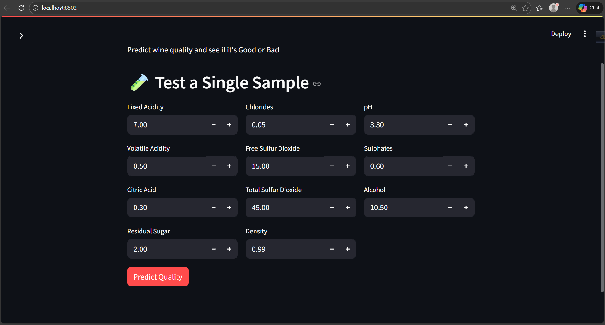
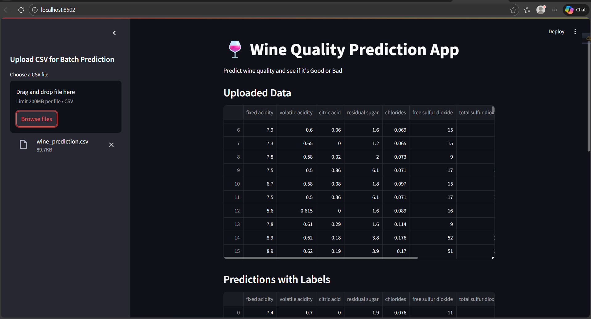

# 🍷 Wine Quality Prediction Using Machine Learning

## Abstract

Wine quality assessment is an important task in the food and beverage industry, as it directly influences consumer satisfaction and market value. This project presents a **machine learning–based wine quality prediction system** that estimates wine quality using physicochemical properties. A trained predictive model is deployed through an interactive **Streamlit web application**, enabling both batch and single-sample predictions.


## Keywords

Wine Quality Prediction, Machine Learning, Feature Scaling, Streamlit, Model Deployment, Classification


## 1. Introduction

Wine quality evaluation traditionally depends on human sensory analysis, which can be subjective and time-consuming. With the advancement of machine learning techniques, predictive models can assist in automating quality assessment based on measurable chemical properties.

This project aims to design and deploy a machine learning model capable of predicting wine quality scores and categorizing wines as **Good** or **Bad**, using supervised learning techniques.


## 2. Objectives

The primary objectives of this project are:

* To develop a machine learning model for wine quality prediction
* To apply proper data preprocessing and feature scaling
* To deploy the trained model using a web-based interface
* To support both batch and single-instance predictions


## 3. Dataset Description

The dataset consists of physicochemical properties of wine samples. Each instance represents a wine sample described by the following features:

* Fixed Acidity
* Volatile Acidity
* Citric Acid
* Residual Sugar
* Chlorides
* Free Sulfur Dioxide
* Total Sulfur Dioxide
* Density
* pH
* Sulphates
* Alcohol

The target variable is the **wine quality score**, which is later mapped into categorical labels.

## 4. Methodology

### 4.1 Data Preprocessing

* Input features are standardized using a feature scaler
* Scaling ensures that all features contribute equally during model prediction

### 4.2 Model Training

* A supervised machine learning model is trained on the preprocessed dataset
* The trained model and scaler are saved using `joblib` for reuse

### 4.3 Model Deployment

* The trained model is integrated into a Streamlit application
* Users can interact with the model through a graphical interface


## 5. System Architecture

1. User inputs data manually or uploads a CSV file
2. Input data is transformed using the trained scaler
3. The scaled data is passed to the trained model
4. The model outputs a predicted quality score
5. The result is displayed along with a quality classification

## 6. Implementation Details

### 6.1 Batch Prediction

The system allows users to upload a CSV file containing multiple wine samples. Predictions are generated for all samples simultaneously, and results are displayed in tabular format.

### 6.2 Single Sample Prediction

Users can manually input feature values to obtain an instant quality prediction for a single wine sample.


## 7. Technology Stack

* **Programming Language:** Python
* **Web Framework:** Streamlit
* **Libraries:** NumPy, Pandas, Joblib
* **Machine Learning:** Scikit-learn

## 8. Prediction Criteria

The predicted wine quality score is rounded to the nearest integer and classified as:

* **Good Wine:** Quality score ≥ 6
* **Bad Wine:** Quality score < 6


## 9. Project Structure

```
Wine-Quality-Prediction/
│
├── model/
│   ├── wine_model.pkl
│   └── scaler.pkl
│
├── app.py
├── requirements.txt
└── README.md
```


## 10. Results and Discussion

The deployed system successfully demonstrates the practical application of machine learning for wine quality prediction. The interactive interface simplifies user interaction, while the trained model provides consistent and reproducible predictions.


## 11. Limitations

* Model performance depends on the quality of training data
* Subjective aspects of wine quality are not considered
* The current system does not include performance metrics in the UI


## 12. Conclusion

This project illustrates the end-to-end workflow of a machine learning system, from model training to deployment. It highlights the importance of preprocessing, feature scaling, and user-friendly deployment for real-world applications.


## 🚀 Installation & Usage

```bash
<<<<<<< HEAD
=======
# Clone the repository
git clone https://github.com/Monower-Hossen/Loan-Status-Prediction.git

# Navigate to project directory
cd Loan-Status-Prediction

>>>>>>> 427eba4eec4dab12ff768c474b2475065b7f3acd
# Install dependencies
pip install -r requirements.txt

# Run Streamlit app
streamlit run app.py
```

## 📈 Results & Performance

The Random Forest model demonstrates strong predictive performance and generalization ability, making it suitable for real-world loan approval systems.


## ⚙️ Installation


## 📸 App Screenshots

### Manual Input Mode


### CSV Upload Mode



## 📜 License

This project is licensed under the **MIT License** – see the [LICENSE](LICENSE) file for details.

<<<<<<< HEAD
## 📬 Contact

**Monower Hossen**
[GitHub](https://github.com/Monower-Hossen) | [LinkedIn](https://www.linkedin.com/in/monower-hossen/)
=======
## Author

**Monower Hossen**
BSc in Computer Science and Engineering
[GitHub](https://github.com/Monower-Hossen) | [LinkedIn](https://www.linkedin.com/in/monower-hossen/)


>>>>>>> 427eba4eec4dab12ff768c474b2475065b7f3acd
